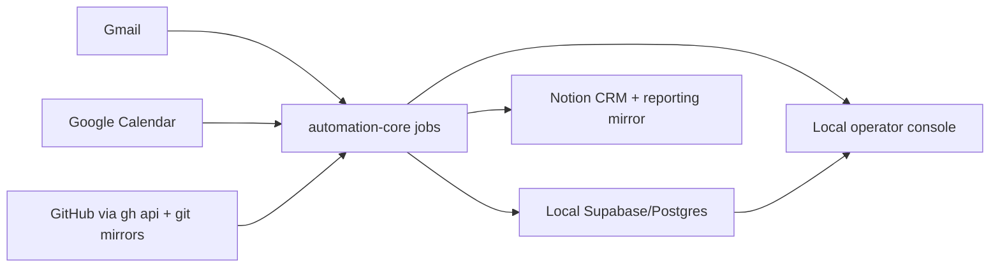

# automation-core Architecture

`automation-core` is a local Node/TypeScript service that now combines two surfaces:

- CRM-style Gmail and Calendar automation
- GitHub repo intelligence ingest and reporting

It runs against a local Supabase/Postgres stack and keeps the operator experience in the same repo.

## Major Components

- `automation-core/src/app.ts` exposes the local HTTP routes and the approval console shell.
- `automation-core/src/server.ts` starts the app and runs startup catch-up.
- `automation-core/src/cli.ts` exposes the operator commands used by Codex automations.
- `automation-core/src/jobs/index.ts` coordinates the sequential jobs.
- `automation-core/src/services/gmail.ts` polls Gmail and stores thread snapshots.
- `automation-core/src/services/calendar.ts` polls Calendar and stores event snapshots.
- `automation-core/src/services/github-analytics.ts` discovers repositories, mirrors git history, computes rollups, and syncs curated GitHub reporting.
- `automation-core/src/services/notion.ts` writes the CRM and reporting mirror data sources.
- `automation-core/src/store.ts` owns the local Postgres connection, migrations, job history, queue state, and GitHub analytics tables.
- `automation-core/supabase/migrations/` defines the bridge schema and the `github_*` analytics tables.

## Data Flow

## Boundaries

- Gmail and Calendar are external evidence sources.
- Notion remains the business record for CRM data and the curated reporting mirror for GitHub summaries.
- Local Supabase/Postgres is the authoritative runtime store for bridge state, GitHub facts, rollups, and job history.
- GitHub analytics facts come from `gh api` plus mirrored git history, not from a separate SaaS warehouse.
- The current web UI still opens as the approval console at the root route; the GitHub dashboard views are not yet a separate route in the app layer.

## Common Change Areas

- Update `src/services/github-analytics.ts` when GitHub ingest, rollups, or Notion reporting change.
- Update `src/jobs/index.ts` when job sequencing or job names change.
- Update `src/app.ts` when new operator routes are exposed.
- Update `supabase/migrations/` when the schema or rollup tables change.
- Update `docs/automation-core.md` and `automation-core/README.md` when the operator flow or startup commands change.
